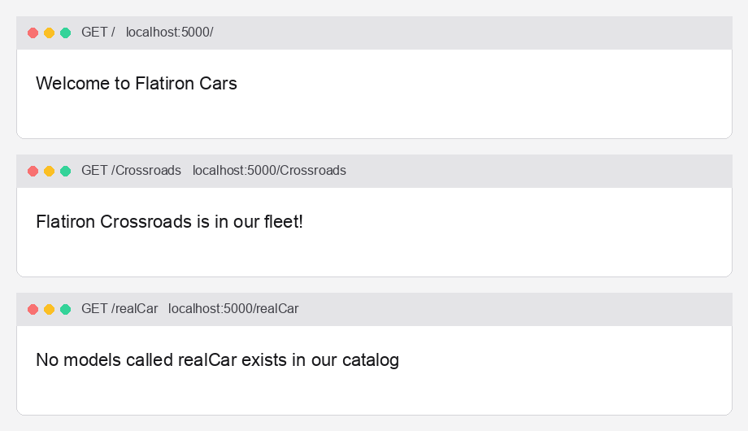

# Flatiron Cars

Flask app that welcomes visitors and looks up car models in the Flatiron fleet.



## Routes

| Method | Path | Response |
| --- | --- | --- |
| `GET` | `/` | `Welcome to Flatiron Cars` |
| `GET` | `/<model>` | `Flatiron {model} is in our fleet!` if the model is in the catalog |
| `GET` | `/<model>` | `No models called {model} exists in our catalog` if it is not |

Current fleet: **Beedle**, **Crossroads**, **M2**, **Panique**.

## Setup

```bash
pipenv install
pipenv shell
```

## Run

```bash
flask --app server/app.py run
```

Then open [http://127.0.0.1:5000/](http://127.0.0.1:5000/) or a model path such as `/Crossroads`.

## Test

```bash
pipenv run pytest -v
```
